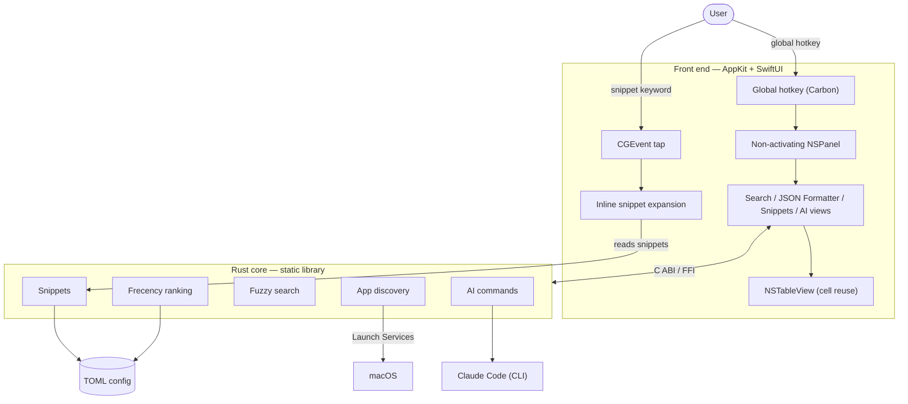

<p align="center">
  
</p>

<h1 align="center">Ainto</h1>

<p align="center">
  <strong>A lightweight, open-source macOS launcher with built-in AI commands.</strong><br>
  <em>The Spotlight & Raycast alternative for engineers who keep it simple.</em>
</p>

<p align="center">
  <a href="https://ainto.app">Website</a> &middot;
  <a href="https://github.com/ainto-labs/ainto-app/issues">Issues</a> &middot;
  <a href="#features">Features</a> &middot;
  <a href="#build">Build</a>
</p>

<p align="center">
  English &middot; <a href="README.zh-TW.md">正體中文</a>
</p>

<p align="center">
  <a href="https://github.com/ainto-labs/ainto-app/releases/latest/download/Ainto.dmg">
    
  </a>
</p>

---

## Features

| Feature | Description |
|---------|-------------|
| **AI** | Press Tab to chat, or select text → run & replace (Fix Grammar, Translate, Summarize, or your own) |
| **App Search** | Fuzzy search and launch macOS apps instantly |
| **JSON Formatter** | Format, minify, validate, and safely query JSON |
| **Snippets** | Text expansion in any app with dynamic placeholders (`{date}`, `{clipboard}`, `{time}`, `{uuid}`) |

> **AI & billing:** Ainto runs the Claude Code CLI on your Mac (`claude -p`), so AI usage is billed to your own Claude account — Ainto stores no API key and never charges you. See [how Claude meters Agent SDK / `claude -p` usage](https://support.claude.com/en/articles/15036540-use-the-claude-agent-sdk-with-your-claude-plan).

## Under the hood

Ainto is a native macOS app: an AppKit + SwiftUI front end over a Rust core, bridged through a C ABI. No Electron, no web view.



- **Rust core.** App discovery, fuzzy search, frecency ranking, snippet expansion, and AI commands all live in a single Rust static library linked into the app.
- **App discovery.** Apps are enumerated through Launch Services, then ordered by a frecency model (recency × frequency) so your most-used apps surface first.
- **Input.** A non-activating `NSPanel` that never steals focus from the app you're in. The global hotkey is a registered system hotkey, while inline snippet expansion is driven by a `CGEvent` tap that watches your keystrokes in any app.
- **Local-first.** Everything lives under `~/.config/ainto/` — TOML for config, snippets, AI commands, and rankings. No telemetry.
- **Distribution.** Builds are signed and notarized before release.

## Build

```bash
# Quick dev build
./build.sh

# Full build, run, and more
make help
```

## Requirements

- macOS 14.0+
- Xcode 15+
- Rust toolchain (`rustup`)

## License

[GPL-3.0-or-later](LICENSE) — Ainto is free software: any fork or derivative must remain open-source under the same license.

---

<p align="center">
  Built by <a href="https://github.com/ainto-labs">Ainto Labs</a>
</p>
