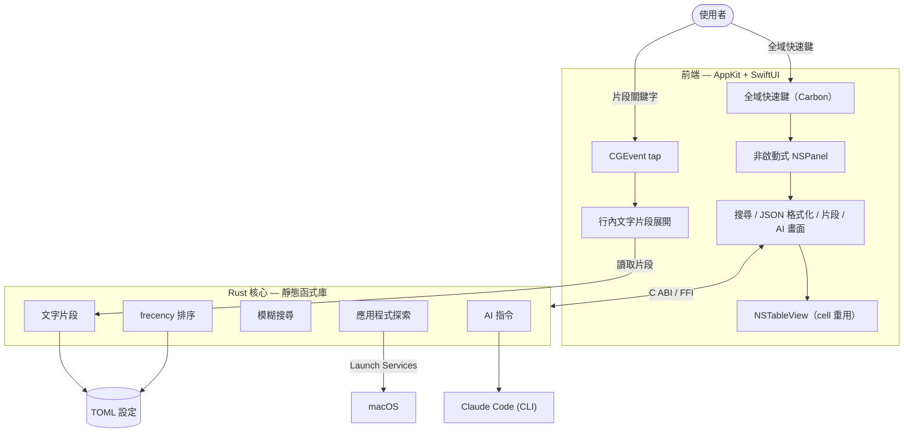

<p align="center">
  
</p>

<h1 align="center">Ainto</h1>

<p align="center">
  <strong>輕量、開源、內建 AI 指令的 macOS 啟動器。</strong><br>
  <em>為喜歡保持簡單的工程師打造的 Spotlight 與 Raycast 替代方案。</em>
</p>

<p align="center">
  <a href="https://ainto.app">官網</a> &middot;
  <a href="https://github.com/ainto-labs/ainto-app/issues">問題回報</a> &middot;
  <a href="#功能">功能</a> &middot;
  <a href="#建置">建置</a>
</p>

<p align="center">
  <a href="README.md">English</a> &middot; 正體中文
</p>

<p align="center">
  <a href="https://github.com/ainto-labs/ainto-app/releases/latest/download/Ainto.dmg">
    
  </a>
</p>

---

## 功能

| 功能 | 說明 |
|------|------|
| **AI** | 按 Tab 開始對話，或選取文字後執行並取代（修正文法、翻譯、摘要，或自訂指令） |
| **應用程式搜尋** | 模糊搜尋並即時啟動 macOS 應用程式 |
| **JSON 格式化** | 格式化、壓縮、驗證並安全查詢 JSON |
| **文字片段** | 在任何 app 中展開文字，支援動態佔位符（`{date}`、`{clipboard}`、`{time}`、`{uuid}`） |

> **AI 與計費：** Ainto 透過你 Mac 上的 Claude Code（`claude -p`）執行 AI，用量計入你自己的 Claude 帳號。Ainto 不儲存 API key，也不向你收費。計費方式請見 [Claude 對 Agent SDK 與 `claude -p` 用量的說明](https://support.claude.com/en/articles/15036540-use-the-claude-agent-sdk-with-your-claude-plan)。

## 技術架構

Ainto 是一個原生 macOS 應用程式，以 AppKit + SwiftUI 為前端，底層是 Rust 核心，兩者透過 C ABI 橋接。沒有 Electron，也沒有 web view。



- **Rust 核心。** 應用程式探索、模糊搜尋、frecency 排序、文字片段展開與 AI 指令，全部位於一個連結進 app 的 Rust 靜態函式庫中。
- **應用程式探索。** 透過 Launch Services 列舉應用程式，再以 frecency 模型（最近使用乘以使用頻率）排序，讓最常用的 app 優先出現。
- **JSON 格式化。** 原生 Swift 編輯器提供語法著色、行號、樹狀折疊、格式化、壓縮與安全的路徑查詢。
- **輸入。** 一個非啟動式的 `NSPanel`，絕不從你正在使用的 app 搶走焦點。全域快速鍵是註冊的系統快速鍵，行內文字片段展開則由監看任意 app 鍵盤輸入的 `CGEvent` tap 驅動。
- **本地優先。** 設定、片段、AI 指令與排序資料都保存在 `~/.config/ainto/` 下，不含遙測。
- **更新。** 建置產物皆經簽署、公證，並透過 [Sparkle](https://sparkle-project.org/) 派送。

## 建置

```bash
# 快速開發建置
./build.sh

# 完整建置、執行與更多指令
make help
```

## 系統需求

- macOS 14.0+
- Xcode 15+
- Rust 工具鏈（`rustup`）

## 授權

[GPL-3.0-or-later](LICENSE)。Ainto 是自由軟體：任何分支或衍生作品都必須以相同授權維持開源。

---

<p align="center">
  由 <a href="https://github.com/ainto-labs">Ainto Labs</a> 打造
</p>
